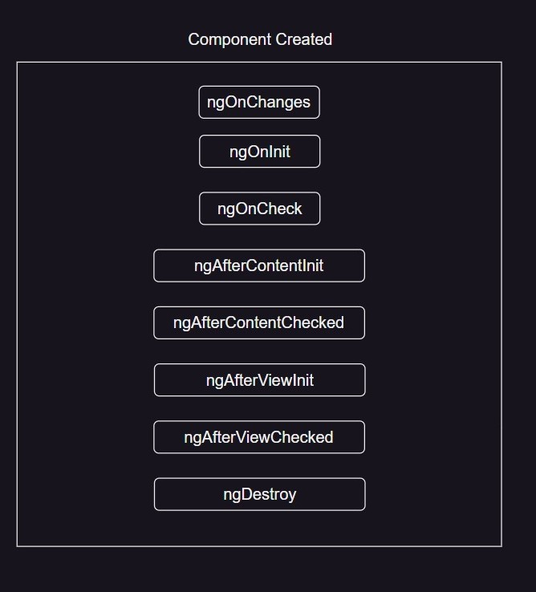

# Angular

Angular is one of the most popular javascript frameowrk for building client side application
It is a development platform for building a single page application for mobile and desktop.
It is used for building client-side-app using htlm, css and a programming language like javascript or typescript.
It is not a programming langugae in itself like javascript.
So, basically Angular is a JS framework which allows us to create Single-Page-Application (SPA).

## Framework

A framework is like a platform for developing software application.
A framework can have pre-defined classes and functions that can be re-used to add several functionalities, which otherwisw we would have to write from scratch by our own.

A framework is a collection of pre-defined classes and methods which provides APIs for performing different operations when used in an application.

## Single-Page-Application

A SPA is a web app, which has only one html page, when we navigate around, only the content of that html page changes. The page itself never changes.

**_What is the advantage of using SPA? Why do we want to create a SPA in the first place?_**
Since we are using javascript to change the content of the page, it is much faster. Here we are not reaching out the server to request a new piece of HTML data, every time we navigate to a different url.
This allows us to create an app which is fast and reactive.

## Why Angular

Vanilla JS or Jquery code becomes hard to maintain and we will need a way to properly structure our app.
A lot of app's built using Vanilla JS/JQuery is hard to test.
There are some functionalities which we will have to write from scratch when using JS.

## Advantages of using Angular

1. Angular gives our app a clean and losely coupled structure that is easy to understand &maintain
2. It brings a lot of utility code which can be re-used in lot of apps. Especially, when dealing with user navigation & browser history
3. Apps built with Angular are more testable.

## Angular versions

Ajs
A2
A3
|
|
|
A17

- Angular Js was not designed with the need of today's app
- Angular 2 was completely re-written from ground up with TS
- It fixed all the issues which Angular 1 had
- There had not been major changes after the release of Angular 2.

## Angular CLI

Angular CLI is a command line interface which we use to create new angular project or generate some boiler plate code as well as create deployable packages

```bash
npm install -g @angular/cli@latest
```

**Create Angular Project**-:

```bash
ng new project_name
```

## Bootstrapping Angular Application

Bootstrapping is the process of initializing or loading the Angular applications.

ng serve-:

- Angular CLI saves the compile Angular application in the memory & directly starts it.
- If we make any changes to our Angular app, Angular CLI will recompile & update the file
- Angular CLI uses Webpack to traverse through our Angular app & it bundles JS & other files into one or more bundles.
- Then Angular CLI also injects the bundled JS & CSS files in the index.html

- When the index.html file is loaded, Angular core libraries & third party libreries are alos loaded by that time.
- Now Angular needs to locate the main entry point
- **_index.html looks for --------> angular.json_**
- **_angular.json -------> main.ts --> AppModule --> AppComponent_**


## What is TypeScript

- TS is free & open-source programming language developed by Microsoft.
- It is a super-set of JS
- It has additional features, which do not exist in current version of JS Supported by most browsers.
- TS is strongly typed, but JS is dynamically typed.
- TS has some Object-Oriented features that we do not have in JS yet.
- With TS, we can catch errors at compile time
- TS code gets converted into JS code in compile time, because after all browser's can only understand JS

## Understanding Component

Angular is a component-based JS framework for building client-side application.
We create these application's with the help of components.

**_A component is basically a small piece of User-interface._**

When we build a angular app first we build bunch of components independent of each other and we to build a complex UI.

**_Every angular app has at least one component_**
which is refer to as root/App component.

**_An Angular app is essentially a tree of components_**
**_Combining all these components together makes an Angular UI_**

## Create a Component

1. create a TS class & export it
2. Decorate the class with @Component decorator
3. Declare the class in main module file

## View Template

The view template of a component is a form of HTML that tells Angular how to render a component.

**Types of Component Selector**-:

1. HTML tag/element
   selector: 'app-nav'
   used for component selection
2. HTML attribute/property
   selector: '[app-nav]'
   It is mainly used for directives
3. CSS class
   selector: '.app-nav'
4. CSS id
   selector: '#app-nav'

## Data Binding

Data binding allows us to communicate between a component class and it's view template & vice-versa
So, we say that the flow of data from component class to view template or from view template to component class is called as data binding.

So based on Data-flow we can divide data binding into two parts

1. One-way Data Binding
   There are three ways of this data binding

   - _string interpolation_, {{}} (TS--> HTML)
     interpolation is used to just display a piece of data in HTML, such as a title or a name.
   - _property binding_, [] (TS-->HTML)
     property binding let us bind a property of a DOM object, for example the hidden property, to some data value. This can let us show or hide a DOM element, or manipulate the DOM in some other way.
     One thing must remember that
     HTML attribute represent the inital value and it does not change
     but a property represent the current value and it can change
   - _event binding_, () (HTML--> TS)
     An event is something that happens, often triggered by user actions or system events, that can be detected and responded to in a program.

2. Two-way Data binding
   data flow from TS--> HTML and at the same time HTML-->TS
   [ngModel] (TS <--> HTML)

## Directive

A directive is an instructions to the DOM.
We use it these for Manipulate DOM, Change behaviour or Add/remove DOM elements.

_Types_


- Component Directives is nothing but components itself in angular.
  it is a directive with a template (other types of directive do not have it) . Components are also kind of instruction to the DOM. Whenever we use a component there we instruct angular to render the view template of tha component.

- Attribute directive is used to change the appearance or behavior of a DOM element. ngStyle, ngClass

- Structural directive is used to add or remove a DOM element on the Webpage ngIf, ngFor, ngSwitch

## @input: custom Property Binding

In Angular, custom property binding refers to the process of binding a custom property of a child component to a property of its parent component. This enables communication between the parent and child components, allowing data to flow from the parent to the child.

## @output: custom event Binding

In Angular, @Output is a decorator used to create a custom event binding in a child component, allowing it to emit events that the parent component can listen to. This mechanism enables communication from the child component back to its parent.

In Angular, when you need to establish communication between components that are not directly related (i.e., they are not parent-child or sibling components), you can use a shared service, a state management library, or other architectural patterns.

## Template Reference Variable in Angular

A template reference variable is a way to create a reference to a template element or Angular component within the template itself. It is declared using the `#` symbol followed by a variable name. This reference variable can then be used to access the element or component in the template or pass it as an argument to a method in the component class.

Here's a simple breakdown:

1. **Create a Template Reference Variable:**

   - Use the `#` symbol to declare a template reference variable.

   ```html
   <!-- Example: Input Element Reference -->
   <input #inputRef type="text" />
   ```

   ```html
   <!-- Example: Component Reference -->
   <app-custom-component #componentRef></app-custom-component>
   ```

2. **Accessing the Reference in the Template:**

   - You can use the reference variable in the template to access the element's properties or call methods.

   ```html
   <!-- Example: Using Input Element Reference -->
   <button (click)="logInputValue(inputRef.value)">Log Input Value</button>
   ```

   ```html
   <!-- Example: Using Component Reference -->
   <button (click)="callCustomComponentMethod(componentRef)">
     Call Method
   </button>
   ```

3. **Passing the Reference to a Method in the Component:**

   - The reference variable can be passed as an argument to a method in the component class.

   ```typescript
   // Example: Component Class
   import { Component } from "@angular/core";

   @Component({
     selector: "app-example",
     template: `...`, // The template with the reference variable
   })
   export class ExampleComponent {
     logInputValue(value: string) {
       console.log(value);
     }

     callCustomComponentMethod(componentRef: CustomComponent) {
       componentRef.customMethod();
     }
   }
   ```

   In this example, `logInputValue` is a method that takes the value of the input element, and `callCustomComponentMethod` is a method that takes a reference to a custom component and calls a method on that component.

Template reference variables are useful for accessing and interacting with elements or components in the template. They provide a way to bridge the template and component logic in Angular applications.

**Decorator**-:

In short, a decorator is a function in TypeScript that is used to extend or modify the behavior of classes, methods, properties, or parameters in a declarative way. It is denoted by the `@` symbol and is widely used in modern JavaScript frameworks like Angular for adding metadata and behavior to various parts of the code.

## ViewChild() in Angular

In Angular, `ViewChild` is a decorator that is used to get the reference of a child component, directive, or element from the template. It allows a parent component to interact with its child components or elements directly. Here's a brief explanation of how `ViewChild` works:

1. **Import `ViewChild`:**

   - First, you need to import the `ViewChild` decorator from `@angular/core`.

   ```typescript
   import { ViewChild } from "@angular/core";
   ```

2. **Use `ViewChild` in the Parent Component:**

   - Apply the `ViewChild` decorator to a property in the parent component, specifying the type of the child component or directive you want to access.

   ```typescript
   import { Component, ViewChild } from "@angular/core";
   import { ChildComponent } from "./child.component";

   @Component({
     selector: "app-parent",
     template: ` <app-child></app-child> `,
   })
   export class ParentComponent {
     @ViewChild(ChildComponent) childComponent: ChildComponent;

     ngAfterViewInit() {
       // Access the child component after it has been initialized
       this.childComponent.doSomething();
     }
   }
   ```

   In this example, `ViewChild` is used to get a reference to the `ChildComponent` in the parent component.

3. **Accessing the Child Component:**

   - Once the parent component has been initialized, you can access properties and methods of the child component using the reference obtained through `ViewChild`. It's common to do this in the `ngAfterViewInit` lifecycle hook to ensure that the child component is ready.

   ```typescript
   export class ChildComponent {
     doSomething() {
       console.log("Doing something in the child component.");
     }
   }
   ```

4. **Query Options:**

   - `ViewChild` takes additional options to fine-tune the selection process. For example, you can use the component's name or template reference variable.

   ```typescript
   @ViewChild('childRef') childComponent: ChildComponent;
   ```

   ```html
   <app-child #childRef></app-child>
   ```

   Here, `#childRef` is a template reference variable, and `ViewChild` uses it to obtain a reference to the child component.

`ViewChild` is a powerful mechanism for parent components to interact with their child components in Angular. It enables communication and coordination between different parts of the application.

## viewChildren

`ViewChildren` is similar to `ViewChild` in Angular but is used to query and obtain references to multiple child components, directives, or elements. While `ViewChild` is used to access a single instance, `ViewChildren` allows you to query multiple instances that match a specified selector.

Here's an overview of how `ViewChildren` works:

1. **Import `ViewChildren`:**

   - First, import the `ViewChildren` decorator from `@angular/core`.

   ```typescript
   import { ViewChildren } from "@angular/core";
   ```

2. **Use `ViewChildren` in the Parent Component:**

   - Apply the `ViewChildren` decorator to a property in the parent component, specifying the type of the child components, directives, or elements you want to query.

   ```typescript
   import { Component, ViewChildren, QueryList } from "@angular/core";
   import { ChildComponent } from "./child.component";

   @Component({
     selector: "app-parent",
     template: `
       <app-child></app-child>
       <app-child></app-child>
     `,
   })
   export class ParentComponent {
     @ViewChildren(ChildComponent) children: QueryList<ChildComponent>;

     ngAfterViewInit() {
       // Access each child component after they have been initialized
       this.children.forEach((child) => {
         child.doSomething();
       });
     }
   }
   ```

   In this example, `ViewChildren` is used to get references to multiple instances of `ChildComponent`.

3. **Accessing Multiple Child Components:**

   - After the parent component has been initialized, you can access properties and methods of each child component using the reference obtained through `ViewChildren`.

   ```typescript
   export class ChildComponent {
     doSomething() {
       console.log("Doing something in a child component.");
     }
   }
   ```

4. **Query Options:**

   - `ViewChildren` also takes additional options to fine-tune the selection process, similar to `ViewChild`.

   ```typescript
   @ViewChildren('childRef') children: QueryList<ChildComponent>;
   ```

   ```html
   <app-child #childRef></app-child> <app-child #childRef></app-child>
   ```

   Here, `#childRef` is a template reference variable, and `ViewChildren` uses it to obtain references to the child components.

`ViewChildren` is beneficial when you need to interact with multiple instances of child components or elements in the template. It provides a convenient way to manage and coordinate behavior across multiple child elements within a parent component.

## ng-template

`ng-template` is an Angular directive that is used to declare a template block in the HTML. It doesn't render anything on its own; instead, it serves as a placeholder for content that can be instantiated later. `ng-template` is often used in conjunction with structural directives like `ngIf`, `ngFor`, and `ngSwitch` to conditionally render or iterate over content.

Here's how `ng-template` is commonly used:

1. **Basic Usage:**

   - You can use `ng-template` to define a template block without rendering any content. The content inside the `ng-template` won't be displayed unless explicitly referenced or instantiated.

   ```html
   <ng-template #myTemplate>
     <!-- Content goes here, but won't be displayed -->
     <p>This content is inside the template.</p>
   </ng-template>
   ```

2. **Using `ngIf` with `ng-template`:**

   - `ngIf` can reference an `ng-template` to conditionally render content based on a condition.

   ```html
   <div *ngIf="condition; then myTemplate else otherTemplate"></div>

   <ng-template #myTemplate>
     <!-- Content to be displayed if condition is true -->
     <p>Content when condition is true.</p>
   </ng-template>

   <ng-template #otherTemplate>
     <!-- Content to be displayed if condition is false -->
     <p>Content when condition is false.</p>
   </ng-template>
   ```

3. **Using `ngFor` with `ng-template`:**

   - `ngFor` can iterate over an array and use an `ng-template` to define the structure of each item.

   ```html
   <ng-container *ngFor="let item of items; let i = index">
     <!-- Content inside the ng-template is repeated for each item -->
     <ng-template #itemTemplate>
       <p>{{ i + 1 }}. {{ item }}</p>
     </ng-template>
   </ng-container>
   ```

4. **Passing Content to `ng-template`:**

   - You can pass content to an `ng-template` using the `ngTemplateOutlet` directive.

   ```html
   <ng-container *ngTemplateOutlet="myTemplate"></ng-container>

   <ng-template #myTemplate>
     <!-- Content to be displayed when ngTemplateOutlet is used -->
     <p>Dynamic content inserted here.</p>
   </ng-template>
   ```

   In this example, the content of `myTemplate` is inserted wherever `ngTemplateOutlet` is used.

`ng-template` provides a way to define reusable template blocks in Angular applications. It is particularly useful when you want to conditionally render content, iterate over a collection, or create dynamic templates that can be reused in different parts of your application.

`ng-container` is a structural directive in Angular that doesn't produce any DOM elements of its own. It's used as a grouping element for other structural directives like `*ngIf`, `*ngFor`, and `*ngSwitch`. `ng-container` allows you to apply these directives to a block of HTML elements without introducing an additional wrapper element in the DOM.

Here are common use cases for `ng-container`:

1. **Grouping without Additional Elements:**

   - When you want to apply structural directives to a group of elements without adding an extra container element to the DOM.

   ```html
   <ng-container *ngIf="condition">
     <!-- Content to be conditionally rendered -->
     <p>Condition is true.</p>
   </ng-container>
   ```

   In this example, the `ng-container` doesn't introduce an extra `div` or any other container in the DOM when the condition is true.

2. **Using `*ngFor` with `ng-container`:**

   - `ng-container` is often used with `*ngFor` to iterate over a collection without introducing an additional container in the DOM.

   ```html
   <ng-container *ngFor="let item of items; let i = index">
     <!-- Content inside ng-container is repeated for each item -->
     <p>{{ i + 1 }}. {{ item }}</p>
   </ng-container>
   ```

   The content inside `ng-container` is repeated for each item without introducing an additional wrapper element.

3. **Hiding Content with `ng-container`:**

   - `ng-container` can be used to conditionally hide or show content without introducing a wrapper element.

   ```html
   <ng-container *ngIf="showContent">
     <!-- Content to be shown or hidden -->
     <p>Content to show or hide.</p>
   </ng-container>
   ```

   The content inside `ng-container` is conditionally rendered based on the value of `showContent`.

4. **Wrapping Multiple Elements:**

   - You can use `ng-container` to wrap multiple elements and apply structural directives to the group.

   ```html
   <ng-container *ngIf="condition; else elseBlock">
     <!-- Content to be rendered if the condition is true -->
     <p>Condition is true.</p>
     <span>Additional content.</span>
   </ng-container>

   <ng-template #elseBlock>
     <!-- Content to be rendered if the condition is false -->
     <p>Condition is false.</p>
   </ng-template>
   ```

   In this example, `ng-container` wraps both the `p` and `span` elements, applying the `*ngIf` directive to the entire group.

`ng-container` is a useful directive when you need to group elements for the purpose of applying structural directives without introducing unnecessary container elements in the final HTML output. It helps keep the DOM cleaner and more semantically meaningful.

## ng-content

`ng-content` is a directive in Angular that is used to project content from the parent component into a specified location within the child component's template. It allows you to create reusable components with flexible layouts, enabling the parent component to provide content that will be dynamically inserted into the child component.

Here's a basic overview of how `ng-content` works:

1. **Defining a Content Projection Point:**

   - In the child component's template, you define a location using the `ng-content` directive where content from the parent component will be projected.

   ```html
   <!-- child.component.html -->
   <div>
     <h2>Child Component</h2>
     <ng-content></ng-content>
   </div>
   ```

   In this example, the `<ng-content></ng-content>` tag serves as a placeholder where content from the parent component will be inserted.

2. **Using the Child Component in the Parent:**

   - In the parent component, you use the child component and provide content to be projected into the designated location.

   ```html
   <!-- parent.component.html -->
   <app-child>
     <p>This content is projected into the child component.</p>
   </app-child>
   ```

   The content inside the `<p>` tag will be dynamically inserted into the `<ng-content></ng-content>` location within the child component.

3. **Projecting Multiple Pieces of Content:**

   - `ng-content` supports the projection of multiple pieces of content by using multiple `<ng-content>` slots with `select` attributes.

   ```html
   <!-- child.component.html -->
   <div>
     <h2>Child Component</h2>
     <ng-content select=".header"></ng-content>
     <ng-content select=".footer"></ng-content>
   </div>
   ```

   ```html
   <!-- parent.component.html -->
   <app-child>
     <div class="header">Header Content</div>
     <p>This content is projected into the child component.</p>
     <div class="footer">Footer Content</div>
   </app-child>
   ```

   In this case, content with the class "header" and "footer" is projected into specific slots within the child component.

`ng-content` is a powerful feature in Angular that enables the creation of flexible and reusable components. It allows components to define flexible layouts while letting the parent components provide content that fits into those layouts. This helps in creating more versatile and composable components in Angular applications.

## ContentChild()

In Angular, the `@ContentChild` decorator is used to query and obtain a reference to the first occurrence of a directive or a component within the content of a component. It allows you to access and interact with content projected into the component.

Here's a detailed explanation with an example:

### Example: Using `@ContentChild`

Let's say we have a directive called `CustomDirective` that we want to use in another component.

1. **Define the Custom Directive:**

   ```typescript
   // custom.directive.ts
   import { Directive } from "@angular/core";

   @Directive({
     selector: "[appCustomDirective]",
   })
   export class CustomDirective {
     // Some directive logic here
   }
   ```

2. **Use the Custom Directive in a Component:**

   ```typescript
   // example.component.ts
   import { Component, ContentChild, AfterContentInit } from "@angular/core";
   import { CustomDirective } from "./custom.directive";

   @Component({
     selector: "app-example",
     template: ` <div appCustomDirective></div> `,
   })
   export class ExampleComponent implements AfterContentInit {
     @ContentChild(CustomDirective) contentChildDirective: CustomDirective;

     ngAfterContentInit() {
       // Access the contentChildDirective after the content has been initialized
       console.log(this.contentChildDirective);
     }
   }
   ```

   In this example, the `ExampleComponent` uses the `appCustomDirective` within its template and queries it using `@ContentChild`.

3. **Include the Components and Directive in a Module:**

   ```typescript
   // app.module.ts
   import { NgModule } from "@angular/core";
   import { BrowserModule } from "@angular/platform-browser";
   import { AppComponent } from "./app.component";
   import { ExampleComponent } from "./example.component";
   import { CustomDirective } from "./custom.directive";

   @NgModule({
     declarations: [AppComponent, ExampleComponent, CustomDirective],
     imports: [BrowserModule],
     bootstrap: [AppComponent],
   })
   export class AppModule {}
   ```

4. **Use the Components in the App:**

   ```html
   <!-- app.component.html -->
   <app-example></app-example>
   ```

   This will create an instance of `ExampleComponent`, and the `CustomDirective` instance within the content will be queried using `@ContentChild`.

### When to Use `@ContentChild`

- Use `@ContentChild` when you want to access the first occurrence of a directive or component within the content of your component.
- Useful for scenarios where you want to interact with or modify the behavior of content projected into your component.

- Make sure to use `ngAfterContentInit` lifecycle hook to ensure that the content has been initialized before accessing it using `@ContentChild`.

The `@ContentChild` decorator is a powerful tool for interacting with content projected into components, allowing you to create more flexible and dynamic component compositions in Angular applications.

In Angular, the @ContentChildren decorator is used to query and obtain references to multiple occurrences of directives or components within the content of a component. It allows you to access and interact with multiple instances of a directive or component that are projected into the component.

## Life Cycle Hooks


