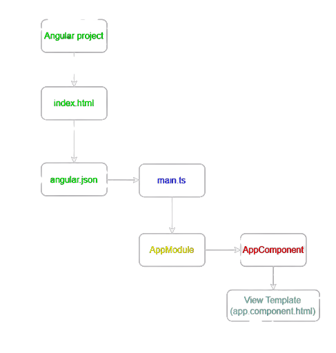

# Angular

**Angular**-:

Angular is one of the most popular javascript frameowrk for building client side application
It is a development platform for building a single page application for mobile and desktop.
It is used for building client-side-app using htlm, css and a programming language like javascript or typescript.
It is not a programming langugae in itself like javascript.
So, basically Angular is a JS framework which allows us to create Single-Page-Application (SPA).

**Framework**-:

A framework is like a platform for developing software application.
A framework can have pre-defined classes and functions that can be re-used to add several functionalities, which otherwisw we would have to write from scratch by our own.

A framework is a collection of pre-defined classes and methods which provides APIs for performing different operations when used in an application.

**Single-Page-Application**-:

A SPA is a web app, which has only one html page, when we navigate around, only the content of that html page changes. The page itself never changes.

**_What is the advantage of using SPA? Why do we want to create a SPA in the first place?_**
Since we are using javascript to change the content of the page, it is much faster. Here we are not reaching out the server to request a new piece of HTML data, every time we navigate to a different url.
This allows us to create an app which is fast and reactive.

**Why Angular**-:

Vanilla JS or Jquery code becomes hard to maintain and we will need a way to properly structure our app.
A lot of app's built using Vanilla JS/JQuery is hard to test.
There are some functionalities which we will have to write from scratch when using JS.

Advantages of using Angular-:

1. Angular gives our app a clean and losely coupled structure that is easy to understand &maintain
2. It brings a lot of utility code which can be re-used in lot of apps. Especially, when dealing with user navigation & browser history
3. Apps built with Angular are more testable.

**Angular versions**-:
Ajs
A2
A3
|
|
|
A17

- Angular Js was not designed with the need of today's app
- Angular 2 was completely re-written from ground up with TS
- It fixed all the issues which Angular 1 had
- There had not been major changes after the release of Angular 2.

**Angular CLI**-:

Angular CLI is a command line interface which we use to create new angular project or generate some boiler plate code as well as create deployable packages

```bash
npm install -g @angular/cli@latest
```

**Create Angular Project**-:

```bash
ng new project_name
```

**Bootstrapping Angular Application**-:

Bootstrapping is the process of initializing or loading the Angular applications.

ng serve-:

- Angular CLI saves the compile Angular application in the memory & directly starts it.
- If we make any changes to our Angular app, Angular CLI will recompile & update the file
- Angular CLI uses Webpack to traverse through our Angular app & it bundles JS & other files into one or more bundles.
- Then Angular CLI also injects the bundled JS & CSS files in the index.html

- When the index.html file is loaded, Angular core libraries & third party libreries are alos loaded by that time.
- Now Angular needs to locate the main entry point
- **_index.html looks for --------> angular.json_**
- **_angular.json -------> main.ts --> AppModule --> AppComponent_**


