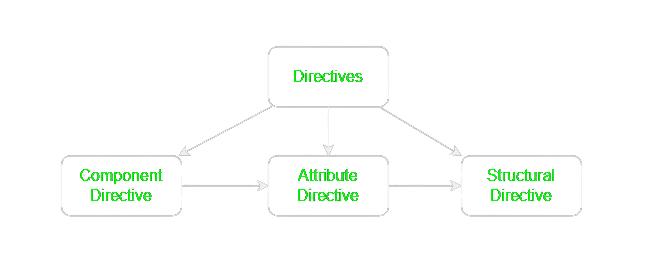

# Angular

**Angular**-:

Angular is one of the most popular javascript frameowrk for building client side application
It is a development platform for building a single page application for mobile and desktop.
It is used for building client-side-app using htlm, css and a programming language like javascript or typescript.
It is not a programming langugae in itself like javascript.
So, basically Angular is a JS framework which allows us to create Single-Page-Application (SPA).

**Framework**-:

A framework is like a platform for developing software application.
A framework can have pre-defined classes and functions that can be re-used to add several functionalities, which otherwisw we would have to write from scratch by our own.

A framework is a collection of pre-defined classes and methods which provides APIs for performing different operations when used in an application.

**Single-Page-Application**-:

A SPA is a web app, which has only one html page, when we navigate around, only the content of that html page changes. The page itself never changes.

**_What is the advantage of using SPA? Why do we want to create a SPA in the first place?_**
Since we are using javascript to change the content of the page, it is much faster. Here we are not reaching out the server to request a new piece of HTML data, every time we navigate to a different url.
This allows us to create an app which is fast and reactive.

**Why Angular**-:

Vanilla JS or Jquery code becomes hard to maintain and we will need a way to properly structure our app.
A lot of app's built using Vanilla JS/JQuery is hard to test.
There are some functionalities which we will have to write from scratch when using JS.

Advantages of using Angular-:

1. Angular gives our app a clean and losely coupled structure that is easy to understand &maintain
2. It brings a lot of utility code which can be re-used in lot of apps. Especially, when dealing with user navigation & browser history
3. Apps built with Angular are more testable.

**Angular versions**-:
Ajs
A2
A3
|
|
|
A17

- Angular Js was not designed with the need of today's app
- Angular 2 was completely re-written from ground up with TS
- It fixed all the issues which Angular 1 had
- There had not been major changes after the release of Angular 2.

**Angular CLI**-:

Angular CLI is a command line interface which we use to create new angular project or generate some boiler plate code as well as create deployable packages

```bash
npm install -g @angular/cli@latest
```

**Create Angular Project**-:

```bash
ng new project_name
```

**Bootstrapping Angular Application**-:

Bootstrapping is the process of initializing or loading the Angular applications.

ng serve-:

- Angular CLI saves the compile Angular application in the memory & directly starts it.
- If we make any changes to our Angular app, Angular CLI will recompile & update the file
- Angular CLI uses Webpack to traverse through our Angular app & it bundles JS & other files into one or more bundles.
- Then Angular CLI also injects the bundled JS & CSS files in the index.html

- When the index.html file is loaded, Angular core libraries & third party libreries are alos loaded by that time.
- Now Angular needs to locate the main entry point
- **_index.html looks for --------> angular.json_**
- **_angular.json -------> main.ts --> AppModule --> AppComponent_**


**What is TypeScript**-:

- TS is free & open-source programming language developed by Microsoft.
- It is a super-set of JS
- It has additional features, which do not exist in current version of JS Supported by most browsers.
- TS is strongly typed, but JS is dynamically typed.
- TS has some Object-Oriented features that we do not have in JS yet.
- With TS, we can catch errors at compile time
- TS code gets converted into JS code in compile time, because after all browser's can only understand JS

**Understanding Component**-:

Angular is a component-based JS framework for building client-side application.
We create these application's with the help of components.

**_A component is basically a small piece of User-interface._**

When we build a angular app first we build bunch of components independent of each other and we to build a complex UI.

**_Every angular app has at least one component_**
which is refer to as root/App component.

**_An Angular app is essentially a tree of components_**
**_Combining all these components together makes an Angular UI_**

**Create a Component**-:

1. create a TS class & export it
2. Decorate the class with @Component decorator
3. Declare the class in main module file

**View Template**-:

The view template of a component is a form of HTML that tells Angular how to render a component.

**Types of Component Selector**-:

1. HTML tag/element
   selector: 'app-nav'
   used for component selection
2. HTML attribute/property
   selector: '[app-nav]'
   It is mainly used for directives
3. CSS class
   selector: '.app-nav'
4. CSS id
   selector: '#app-nav'

**Data Binding**-:

Data binding allows us to communicate between a component class and it's view template & vice-versa
So, we say that the flow of data from component class to view template or from view template to component class is called as data binding.

So based on Data-flow we can divide data binding into two parts

1. One-way Data Binding
   There are three ways of this data binding

   - _string interpolation_, {{}} (TS--> HTML)
     interpolation is used to just display a piece of data in HTML, such as a title or a name.
   - _property binding_, [] (TS-->HTML)
     property binding let us bind a property of a DOM object, for example the hidden property, to some data value. This can let us show or hide a DOM element, or manipulate the DOM in some other way.
     One thing must remember that
     HTML attribute represent the inital value and it does not change
     but a property represent the current value and it can change
   - _event binding_, () (HTML--> TS)
     An event is something that happens, often triggered by user actions or system events, that can be detected and responded to in a program.

2. Two-way Data binding
   data flow from TS--> HTML and at the same time HTML-->TS
   [ngModel] (TS <--> HTML)

**Directive**-:
A directive is an instructions to the DOM.
We use it these for Manipulate DOM, Change behaviour or Add/remove DOM elements.

_Types_


- Component Directives is nothing but components itself in angular.
  it is a directive with a template (other types of directive do not have it) . Components are also kind of instruction to the DOM. Whenever we use a component there we instruct angular to render the view template of tha component.

- Attribute directive is used to change the appearance or behavior of a DOM element. ngStyle, ngClass

- Structural directive is used to add or remove a DOM element on the Webpage ngIf, ngFor, ngSwitch

**@input: custom Property Binding**-:

In Angular, custom property binding refers to the process of binding a custom property of a child component to a property of its parent component. This enables communication between the parent and child components, allowing data to flow from the parent to the child.

**@output: custom event Binding**-:

In Angular, @Output is a decorator used to create a custom event binding in a child component, allowing it to emit events that the parent component can listen to. This mechanism enables communication from the child component back to its parent.

In Angular, when you need to establish communication between components that are not directly related (i.e., they are not parent-child or sibling components), you can use a shared service, a state management library, or other architectural patterns. Here's an example using a shared service:
